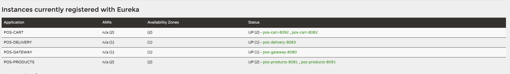
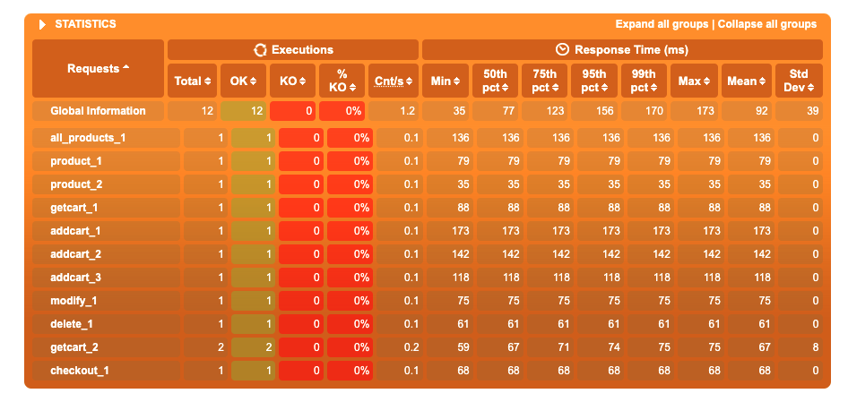
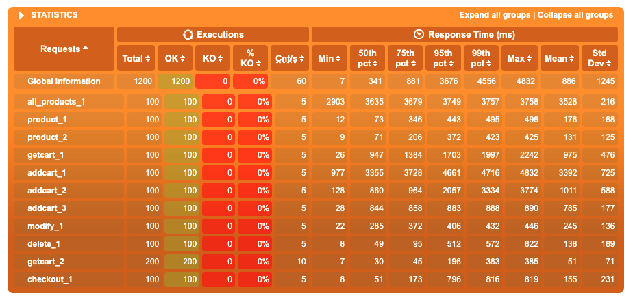
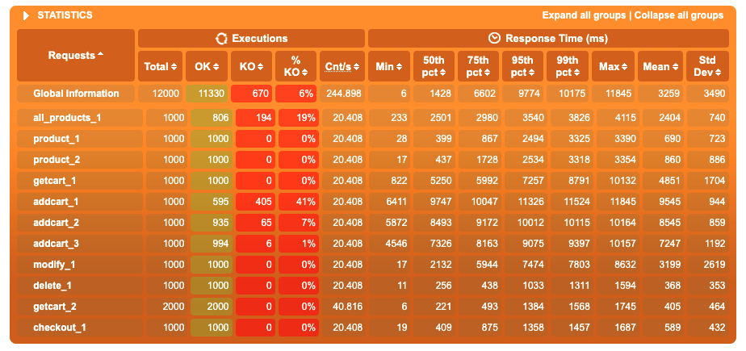
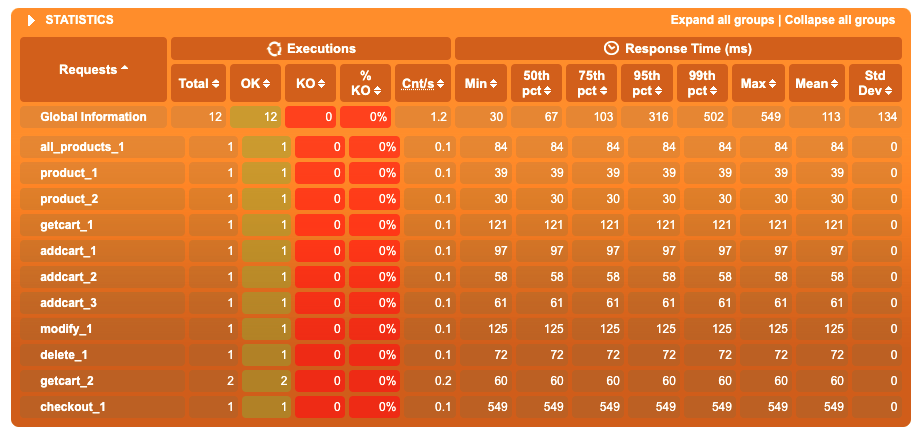
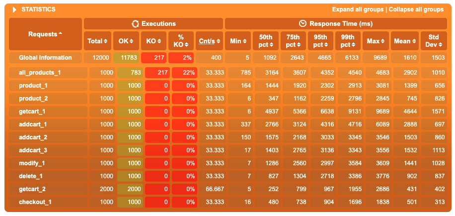

# aw10-final

Please develop a **fully functional** online purchase order system.

- It should have a superb collection of goods merchandises
- Customer can browse/search for merchandises, add selected one into his shopping cart and checkout to complete a transaction.
- User can get delivery status updates continuously.

The system should be of a **reactive architecture**, which means it should be 

-  Responsive: it should response to the user request timely.
-  Resilient: it should not be easily broken down.
-  Elastic: it should be flexible to scale out.
-  Message Driven: it should has loosely coupled components that communicates with each other asynchronously.

Please design tests/experiements to demostrate that your system fulfills such requirements as stated in [The Reactive Manifesto](https://www.reactivemanifesto.org)

**Submit your codes/documents/tests/experiements of your system.**

# 简报

## 要求
请开发一个功能齐全的在线采购订单系统。

- 它应该有一个极好的商品集合
- 客户可以浏览/搜索商品，将选定的商品添加到购物车并结帐以完成交易。
- 用户可以不断获取交货状态更新。

系统应该是反应式架构，这意味着它应该是
- 高响应性：及时响应用户请求。
- 可靠性：它不应该被轻易崩溃。
- 弹性：它应该灵活地向外扩展。
- 消息驱动：它应该具有松散耦合的组件，彼此异步通信。

## 系统简介

系统架构图如下：

系统中共有5个微服务构成：
- discovery微服务是eureka服务器，其他微服务均对应的是客户端。
- gateway微服务，网关微服务，实际上就是为了对外提供一个统一的接口。
- products微服务，负责管理商品集合，提供了浏览搜索商品的能力。
- cart微服务，提供了添加商品到购物车以及结账届接口。
- delivery微服务，负责处理交货状态，提供了信息查询接口，以及sse功能为用户不断推送订单状态。

通过以上5个微服务，我们实现了要求：一个功能齐全的在线采购订单系统

一个典型的系统运行状态如下：

请注意这里并没有容器化运行的redis服务与rabbitMQ服务。

以下将介绍对应的一些特性

### 高响应性

通过gatling工具的压力测试来展现响应性。

所有服务均运行在一台16g内存的M1芯片的MacBook Air上。

系统运行状态如上节图。

使用的测试脚本在仓库gatling-test/testfile目录下。

简单而言，测试是模拟了一个用户逛商场的简要流程：先列出全部商品，对某些商品进行查看，添加购物车，购物车操作，结账。

压力测试包含了3个子测试：1个用户，100个用户，1000个用户，结果分别在仓库gatling-test/testres目录下。

关键内容截图如下（从上至下1，100，1000用户）：

我们可以看到，相对而言，耗时最长的操作是addcart 这可能是因为系统实际上需要在这个操作中来去products服务上寻找商品信息。尽管products服务上配置了缓存，但是网络操作本身就是相对耗时的。

发现了这个问题后，为相关方法加入了cache，这个优化实装后情况如下（从上至下新版的1用户 1000用户）：

注意到1用户checkout时间较长，这可能是因为服务器还没有建立与消息队列的完全连接

从这里可以直接发现在优化版本中，addcart操作不会再产生错误了。实际上addcart操作的错误是由于响应时间超过10s网关认定连接中断导致的，在优化后最大响应时间小于10是，所以没有出现问题。

而对于最开始查看所有products的操作中的异常`Connection reset by peer` 现在看来可能是由于并发连接较大无法处理导致的。对此我没找到什么好的解决方案。

优化版的代码放在了[aw05仓库的对应分支](https://github.com/sawork-2022/aw05-Price1999a/tree/aw09) 中，由于不涉及到功能性重构，没有在此仓库版本中更改代码。

从压力测试中我们可以发现，即使在我这台性能不算强的机子上，也可以几乎支持1000人的并发压力测试。
且这个能力可以通过简单的增加carts服务products服务数量来增强。

### 可靠性

#### 水平拓展

我们可以注意到，在系统运行时，真正不可或缺的微服务是discovery微服务与gateway微服务。
而这两者上并不真正运行业务，这就是说，他们本身运行压力是较小的那一类。

另外，discovery微服务使用的是eureka，这就是说，它是可以被集群化的，当然考虑到实际应用的规模，我们没有做这个选择。

而gateway微服务实际上在这个系统中起到的主要作用就是转发http请求所以原则上也是可以运行多个实例。当然考虑到实际应用的规模，我们没有做这个选择。

接下来讨论剩下三个微服务：products微服务、cart微服务已经水平拓展了，而delivery微服务没有水平拓展的原因在于，由于受限于开发时间，数据库层实现过于简略以至于目前无法保证水平拓展下的数据库一致性。但这个属于开发过程中的取舍，并不是真的存在方法层面的不可实现性。

另外还有系统所需要的redis服务器与RabbitMQ消息队列组件，他们都可以轻易水平拓展增强可靠性（但由于实验平台机器性能限制我们没有这么做）

总之，通过以上讨论我们已经可以得出简要的结论：系统中的各个组件都有水平拓展的能力，互为备份，由此整个系统的可靠性大大增强。

#### 从最坏情况讨论

下面我们来讨论假如系统某个节点完全失效会导致多大的问题（请注意，以下讨论均基于当前实现的系统）。

- discovery微服务：全系统对外全部失能，网关需要它来转发到正确的服务器。失去了它，动态的微服务服务器地址就不可知了。系统不会丢失信息。
- gateway微服务：全系统对外全部失能，但是系统不会丢失信息。
- products微服务：交货状态更新仍可保持，其余业务失能，但是系统不会丢失信息。
- cart微服务：购物车相关业务失能，其余正常，已有订单信息不影响，当前处理的购物车数据可能损失。
- delivery微服务：交货状态查询失能，其余正常，已有订单信息损失，若长久不恢复可能导致新订单信息被消息队列丢弃。
- redis服务器：购物车相关业务失能，查询商品信息功能由于失去缓存性能降级，购物车信息全部丢失，其余正常。
- RabbitMQ消息队列：订单信息无法被正常传送到delivery微服务，相关新订单丢失，其余正常

### 弹性

在 **可靠性** 一节中，我们已经讨论了系统水平拓展的能力，从架构设计上讲，通过简单的修改配置，系统各组件都可以进行水平拓展。

而只要能够购买更好的硬件，垂直拓展也没有任何问题，系统并不依赖于某些硬件特性，可以轻松的在ARM架构上，X86架构上运行。

### 消息驱动

整个系统中组件间的耦合主要是以下两条：
- cart微服务需要从products微服务中寻找商品信息
- cart微服务通过消息队列将订单传送到delivery微服务

考虑到前者需求，前者并不能处理成异步，因为后续需要这个信息，所以这里必须是阻塞的。

而后者通过消息队列来实现了异步处理。是消息驱动的。

## 功能备注 

delivery微服务上开启了SSE功能

使用例子：访问 `http://localhost:8080/delivery-sse/admin` 

Server-Sent Events(SSE) 是一种服务器推送技术, 使客户端可以通过 HTTP 连接从服务器自动接收更新. 每个通知以文本流(文本应该为 utf-8)的形式发送, 并以一对换行符结尾.
例如推特点赞数量实时更新就依赖于此。
相较于传统的客户端定时轮询，他不需要建立连接HTTP连接的过程，因此更加节省服务器资源

