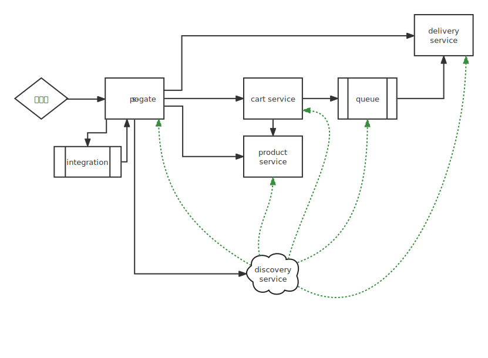

# RESTful microPoS 

请参考spring-petclinic-rest/spring-petclinic-microserivces 将aw04的webpos项目改为rest风格的微服务架构
（至少包含产品管理服务pos-products和购物车管理服务pos-carts以及discovery/gateway等微服务架构下需要的基础设施服务）。具体要求包括：

1. 请使用OpenAPI的定义每个服务的rest接口（参考pos-products）
2. 请使用ehcache管理缓存；done
3. 请注意使用断路器等机制；简单来讲，这里断路器就是说假如连续多次调用都寄了，就不再尝试了
4. 有兴趣的同学可自学一些reactjs或vuejs等为microPoS开发一个前端。完全不懂

## 简介

在pos-products与pos-cart模块中，使用OpenAPI的定义每个服务的rest接口。

使用ehcache缓存了从京东获取的数据库，使用redis管理了session数据库

在pos-gateway上配置了断路器

在当前架构中pos-discovery是EurekaServer，其他模块则是EurekaClient。网关模块为两个微服务以及客户端提供统一的路由，断路器配置在网关模块中，而pos-cart模块对pos-products相关内容的远程调用也通过网关路由，由此全系统上都配置了断路器。

## aw07拓展
aw07要求我们在原有的程序中拓展一个快递服务，通过消息中间件来异步处理。

为此新增了一个微服务，也为其配置了网关。

当前系统的接口文档是如下markdown文件：[aw07下的接口状态](interface-aw07.md)

当前系统的总体架构图大致如下：

## aw08拓展
简单来讲，aw08我们在网关上配置了一个Spring集成来转发对delivery服务的请求。

具体而言，采用响应式的InBound网关，接受 `/si-api/delivery/{userId}`这样的Http请求 ，并且将它转发到网关对应的API上。

这里使用响应式的原因在于spring cloud gateway 与 spring 集成中的Inbound网关必须在这种条件下才能共存。

之所以转发到网关自己身上是为了尝试尽量利用目前已有的网关上的负载均衡断路器等特性。并且在这种情况下，硬编码的外部服务网址实际上也更加可靠。

总之，当前系统的总体架构图大致如下：

## aw09拓展
将系统改为反应式的

当前系统的总体架构图大致如下：

其中虚线是反应式的服务的意思，同时cart product两个服务是可以平行拓展的。

由于delivery服务数据库设计方面的原因，目前它并不能支持水平拓展，但这主要是受到开发时间的限制。
